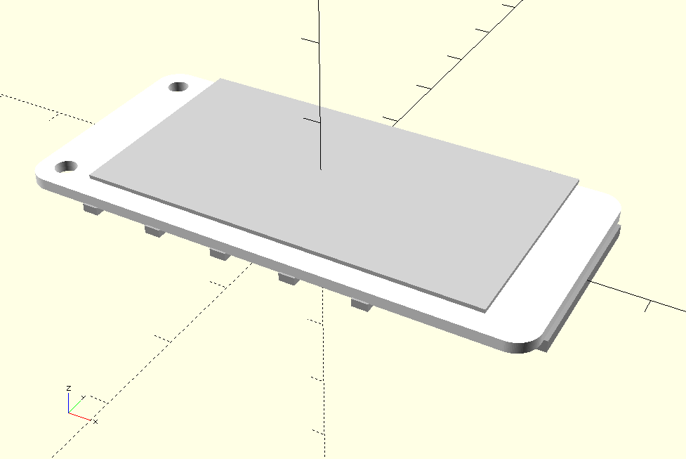
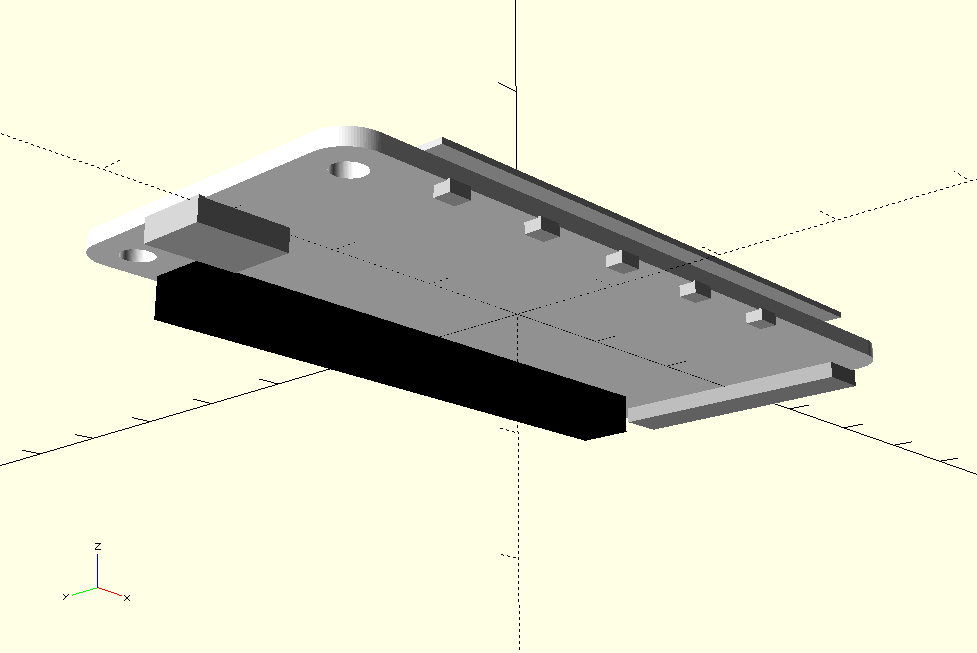

# raspberrypi_library

[OpenSCAD](http://www.openscad.org/) library files for designing and creating Raspberry Pi related parts.

## Instructions

* Add `use <filename.scad>` (e.g.  `use <papirus_hat_pizero.scad>`) to your *.scad file
* Call `papirus_hat_pizero();` module from your *.scad file

## Content

* `papipus_hat_pizero.scad`: OpenSCAD model for [PaPiRus Zero - ePaper / eInk Screen pHAT for Pi Zero](https://uk.pi-supply.com/products/papirus-zero-epaper-screen-phat-pi-zero) 

## Credits

Based on model library from Saarbastler:
 * https://github.com/saarbastler/library.scad